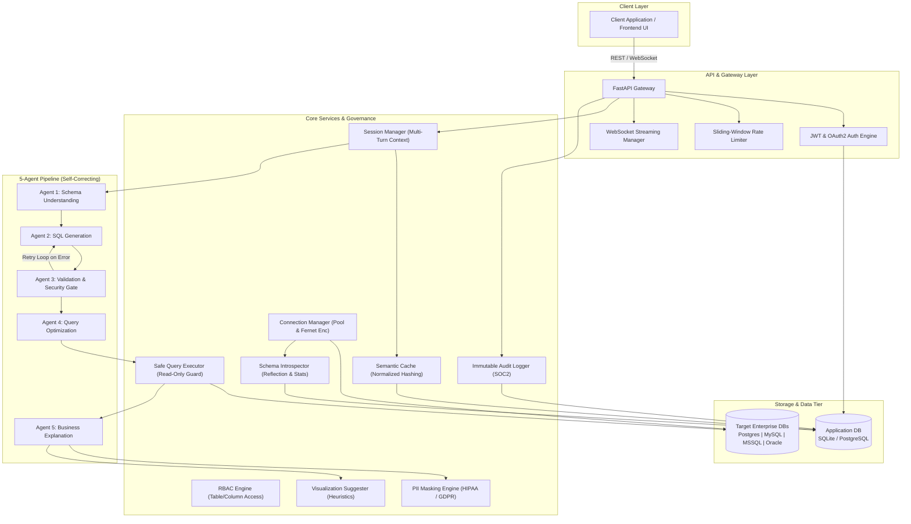

# 🧭 QueryPilot — Autonomous SQL Database Analyst

> **Enterprise-Ready Natural Language to SQL Analytics Engine**  
> Bridge the gap between non-technical business stakeholders and enterprise databases through a self-correcting 5-agent AI pipeline, hardened with strict RBAC, automated PII masking, read-only guardrails, and audit compliance logging.

---

## 🏗️ Architecture Overview



---

## 🚀 Key Features

### 1. Self-Correcting 5-Agent Pipeline
- **Agent 1 (Schema Understanding)**: Introspects tables, types, foreign keys, cardinality, and compresses relevant context into compact system prompts.
- **Agent 2 (SQL Generation)**: Generates dialect-specific SQL (PostgreSQL, MySQL, T-SQL for MSSQL, PL/SQL for Oracle) taking conversational history into account.
- **Agent 3 (Validation & Security)**: AST & syntax validation, safety checks (prohibits DDL/DML, drop, truncate), and checks RBAC policies. Automatically loops back to Agent 2 with exact error messages if validation fails.
- **Agent 4 (Optimization)**: Evaluates query complexity, missing indexes, partition pruning, and injects optimal `LIMIT` clauses.
- **Agent 5 (Explanation)**: Translates query results into plain-English executive summaries and key takeaway bullets.

### 2. Multi-DB Connection Pooling & Encryption
- Dynamic connection pooling for **PostgreSQL**, **MySQL**, **Microsoft SQL Server**, and **Oracle Database**.
- Connection passwords and sensitive connection parameters encrypted at rest using **Fernet symmetric cryptography**.

### 3. Enterprise Security, RBAC & PII Masking
- **Role-Based Access Control**: Pre-seeded with `admin`, `analyst`, and `viewer` roles. Per-table access control and blocked column visibility.
- **PII Masking Engine**: Automatically masks names, emails (`j***@example.com`), phone numbers (`***-***-5678`), SSNs (`***-**-1234`), and addresses in compliance with GDPR, HIPAA, and SOC2.
- **Safe Query Execution**: Read-only enforcement via regex patterns and transaction isolation, with automatic execution timeouts and row limit caps.

### 4. Semantic Cache
- Intelligent natural language question normalization (stripping stop words, sorting tokens, lowercase normalization) and hash matching to serve repeated questions with zero LLM API latency and cost.

### 5. Automated Visualization Suggester
- Evaluates result cardinality, column types, and GROUP BY patterns to automatically recommend optimal chart formats (**KPI card**, **Line chart**, **Bar chart**, **Choropleth map**, **Scatter plot**, **Pie chart**, or **Data table**).

### 6. Streaming Real-Time Status via WebSockets
- WebSocket endpoint at `/ws/chat/{session_id}` emits real-time pipeline status events (`"Understanding schema..."`, `"Generating SQL..."`, `"Validating query..."`, `"Executing..."`, `"Explaining results..."`).

---

## 📁 Project Structure

```
QueryPilot/
├── app/
│   ├── __init__.py
│   ├── main.py                     # FastAPI application entry point & lifespan
│   ├── config.py                   # Pydantic Settings & environment variables
│   │
│   ├── api/
│   │   ├── middleware/
│   │   │   └── rate_limiter.py     # In-memory sliding window rate limiter
│   │   ├── routes/
│   │   │   ├── auth.py             # User registration, login, JWT & profile
│   │   │   ├── connections.py      # Database connection management & test
│   │   │   ├── chat.py             # Chat sessions, query execution & explain
│   │   │   ├── schema.py           # Schema introspection & PII metadata
│   │   │   ├── admin.py            # RBAC policies and user management
│   │   │   ├── audit.py            # Audit log retrieval & stats dashboard
│   │   │   └── health.py           # Health check and root info
│   │   └── websockets/
│   │       └── chat_ws.py          # WebSocket handler for streaming chat
│   │
│   ├── core/
│   │   ├── security.py             # Bcrypt hashing, JWT tokens, Fernet encryption
│   │   ├── rbac.py                 # Role-based access control engine
│   │   ├── pii_masking.py          # PII detection & masking rules
│   │   ├── viz_suggester.py        # Automated chart recommendation engine
│   │   └── query_executor.py       # Safe read-only query runner with row limits
│   │
│   ├── services/
│   │   ├── connection_manager.py   # Multi-engine connection pool manager
│   │   ├── schema_introspector.py  # DB metadata introspection & schema extraction
│   │   ├── session_manager.py      # Conversation state & multi-turn history
│   │   ├── semantic_cache.py       # Question normalization & SQL caching
│   │   ├── audit_service.py        # Append-only audit logger for queries/actions
│   │   └── pipeline.py            # 5-agent pipeline orchestrator
│   │
│   ├── agents/
│   │   ├── base.py                 # Abstract agent base class
│   │   ├── schema_agent.py         # Agent 1 (Schema Understanding)
│   │   ├── generation_agent.py     # Agent 2 (SQL Generation)
│   │   ├── validation_agent.py     # Agent 3 (Validation & Guardrails)
│   │   ├── optimization_agent.py   # Agent 4 (Optimization)
│   │   └── explanation_agent.py    # Agent 5 (Result Explanation)
│   │
│   ├── models/                     # SQLAlchemy ORM Models
│   │   ├── user.py                 # User model
│   │   ├── connection.py           # Connection credentials model
│   │   ├── session.py              # ChatSession model
│   │   ├── message.py              # ChatMessage model
│   │   ├── audit_log.py            # AuditLog model
│   │   ├── cache_entry.py          # CacheEntry model
│   │   ├── rbac.py                 # Role & TablePolicy models
│   │   └── schema_metadata.py      # SchemaMetadata model
│   │
│   ├── schemas/                    # Pydantic validation schemas
│   │   ├── auth.py
│   │   ├── connection.py
│   │   ├── chat.py
│   │   ├── schema.py
│   │   ├── audit.py
│   │   └── admin.py
│   │
│   └── db/
│       └── database.py             # Async engine, sessionmaker & init_db
│
├── tests/                          # Pytest test suite
│   ├── conftest.py                 # Fixtures: async client, memory DB, auth tokens
│   ├── test_auth.py                # Auth endpoint tests
│   ├── test_connections.py         # Connection CRUD tests
│   ├── test_pii_masking.py         # PII masking tests
│   ├── test_rbac.py                # RBAC table & column policy tests
│   ├── test_semantic_cache.py      # Question normalization & cache tests
│   ├── test_query_executor.py      # Read-only guardrail tests
│   ├── test_viz_suggester.py       # Visualization heuristic tests
│   └── test_audit.py               # Audit service & logging tests
│
├── requirements.txt                # Python dependencies
├── .env.example                    # Sample environment variables
└── README.md                       # Documentation
```

---

## ⚙️ Quickstart & Setup

### 1. Clone & Environment Setup

```bash
# Clone the repository
git clone https://github.com/your-org/QueryPilot.git
cd QueryPilot

# Create a virtual environment
python -m venv venv

# Activate the virtual environment
# Windows:
.\venv\Scripts\activate
# Linux / macOS:
source venv/bin/activate

# Install dependencies
pip install -r requirements.txt
```

### 2. Configure Environment Variables

Copy the sample environment file:
```bash
cp .env.example .env
```

Edit `.env` as required:
```ini
# Application Database
APP_DB_URL=sqlite+aiosqlite:///./querypilot.db

# Security & JWT
SECRET_KEY=your-secure-random-secret-key-at-least-32-chars
JWT_ALGORITHM=HS256
ACCESS_TOKEN_EXPIRE_MINUTES=60
ENCRYPTION_KEY=your-fernet-key-32-urlsafe-base64-bytes

# LLM Configuration
LLM_MODE=online
LLM_API_URL=https://api.openai.com/v1/chat/completions
LLM_API_KEY=your-llm-api-key
LLM_MODEL=gpt-4

# Query Constraints
MAX_QUERY_ROWS=10000
QUERY_TIMEOUT_SECONDS=30
CACHE_TTL_SECONDS=3600
```

### 3. Run the Application

```bash
uvicorn app.main:app --reload --host 0.0.0.0 --port 8000
```

The application automatically creates database tables and seeds default roles on startup.
- **Interactive OpenAPI Documentation (Swagger UI)**: `http://localhost:8000/docs`
- **ReDoc UI**: `http://localhost:8000/redoc`
- **Health Check**: `http://localhost:8000/health`

---

## 📡 API Reference Summary

| Method | Endpoint | Description | Access |
|---|---|---|---|
| `GET` | `/health` | Application health and status | Public |
| `POST` | `/api/auth/register` | Register a new user account | Public |
| `POST` | `/api/auth/login` | Login and obtain JWT access token | Public |
| `GET` | `/api/auth/me` | Fetch authenticated user profile | Authenticated |
| `GET` | `/api/connections` | List user's saved DB connections | Authenticated |
| `POST` | `/api/connections` | Create & encrypt external DB connection | Authenticated |
| `POST` | `/api/connections/{id}/test` | Test live database connectivity & latency | Authenticated |
| `DELETE` | `/api/connections/{id}` | Delete a database connection | Authenticated |
| `GET` | `/api/schema/{conn_id}` | Fetch cached database schema | Authenticated |
| `POST` | `/api/schema/{conn_id}/sync` | Trigger fresh schema introspection | Authenticated |
| `PATCH` | `/api/schema/{conn_id}/tables/{table}/columns/{col}` | Update column PII tag or description | Authenticated |
| `POST` | `/api/chat/sessions` | Create a new multi-turn chat session | Authenticated |
| `GET` | `/api/chat/sessions` | List user's chat sessions | Authenticated |
| `GET` | `/api/chat/sessions/{id}` | Get session details & message history | Authenticated |
| `POST` | `/api/chat/sessions/{id}/messages` | Submit query to 5-agent pipeline | Authenticated |
| `POST` | `/api/chat/explain-sql` | Reverse mode: explain existing raw SQL query | Authenticated |
| `WS` | `/ws/chat/{session_id}` | WebSocket stream for live pipeline events | Authenticated |
| `GET` | `/api/audit/logs` | Fetch paginated query audit logs | Admin |
| `GET` | `/api/audit/stats` | Aggregate query & user statistics | Admin |
| `GET` | `/api/admin/users` | List all users and assigned roles | Admin |
| `PATCH` | `/api/admin/users/{id}/role` | Update user role (`admin`, `analyst`, `viewer`) | Admin |
| `POST` | `/api/admin/policies` | Create table access policy & column rules | Admin |

---

## 🧪 Testing

Run the full pytest suite with asynchronous support:

```bash
# Run all unit and integration tests
pytest tests/ -v

# Run with test coverage report
pytest tests/ --cov=app --cov-report=term-missing
```

---

## 🛡️ Enterprise Compliance & Security Notes
- **SOC 2 Type II**: Every query, user ID, IP address, generated SQL, executed SQL, execution duration, and row count is persisted in an append-only audit trail.
- **HIPAA / GDPR**: Automatic PII identification and masking at rest and in transit prevents unauthorized leakage of sensitive health or personal data.
- **Least Privilege**: Non-admin users are strictly governed by RBAC policies; attempts to access restricted tables are preemptively rejected prior to SQL execution.
